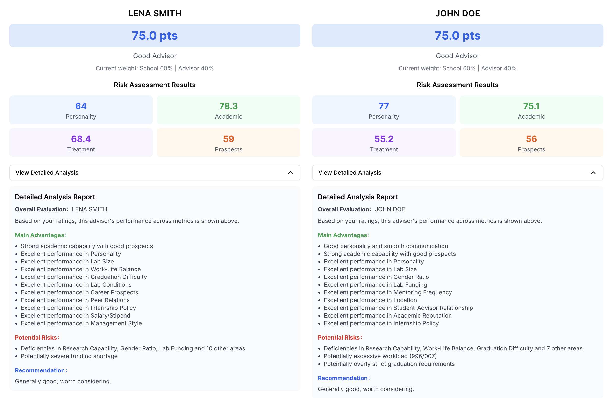

# 这个导师坑不坑·测算版

> 科学评估导师综合实力，助你明智选择学术道路。科学对比多个导师，帮你避坑黑导师。


[](https://advisor-calculator.onrender.com/) [](https://github.com/ktwu01/advisor-calculator) 
[](https://github.com/ktwu01/advisor-calculator/fork) 


[](README.md) [](README.CN.md) [](README.es.md) [](README.fr.md) [](README.ja.md)

---

Detailed-Analysis:


## 🎯 产品特色

### 🔍 全新20维度评估体系
- **人品评估**：导师人品、沟通能力、管理风格、师生关系
- **学术能力**：科研实力、学术声誉、发展前景、研究经费
- **工作环境**：工作生活平衡、实验室条件、地理位置、课题组规模
- **职业发展**：毕业难易度、实习政策、薪资待遇、同学关系

### 🎚️ 智能权重系统
- **硕士推荐**：学校60% | 导师40%
- **博士推荐**：学校30% | 导师70%  
- **博士后推荐**：学校20% | 导师80%
- **手动调节**：支持个性化权重配置
- **智能提示**：详细的权重定义说明

### 📊 全新智能分析报告
- **分项得分可视化**：人品分、学术分、待遇分、前景分
- **精准风险识别**：自动识别所有小于3分的具体评价指标
- **个性化优势分析**：突出4-5分的优秀表现
- **针对性建议**：基于具体风险点的决策指导
- **可折叠详细报告**：完整的分析展开

### 💾 完整数据管理
- **导入/导出功能**：JSON格式数据备份
- **导师昵称系统**：支持花名管理，保护隐私
- **本地存储**：数据安全，不上传服务器
- **版本控制**：数据文件包含版本信息

### 🎨 卓越用户体验
- **描述性评分**：直观文字描述（如"996/007"）替代数字
- **响应式设计**：完美支持桌面和移动设备
- **实时计算**：即时更新评分和建议
- **多导师对比**：最多3个导师同时评估
- **无障碍设计**：支持键盘导航和屏幕阅读器

## 🚀 快速开始

### 环境要求
- Node.js 16+ 
- npm/yarn/pnpm/bun

### 安装运行

```bash
# 克隆项目
git clone https://github.com/ktwu01/advisor-calculator.git
cd advisor-calculator

# 安装依赖
npm install

# 启动开发服务器
npm run dev
```

访问 [http://localhost:3000](http://localhost:3000) 查看应用

### 部署

```bash
# 构建生产版本
npm run build

# 启动生产服务器
npm start
```

## 📋 详细使用指南

### 1. 基本信息设置
- **导师昵称**：建议使用花名（如"X老登"），便于识别和数据管理
- **导师性别**：影响管理风格权重计算
- **年龄段**：青年/中年/资深导师，影响经验评估
- **导师头衔**：从普通青椒到院士，自动调整学术权重
- **学校等级**：7个等级从职业院校到全球顶尖
- **攻读学位**：选择后自动调整权重配置

### 2. 20项评价指标详解
**人品维度（4项）**
- 导师人品、沟通能力、管理风格、师生关系

**学术维度（4项）**  
- 科研实力、圈内声誉、发展前景、研究经费

**工作维度（6项）**
- 工作生活平衡、课题组资金、实验室条件、地理位置、课题组规模、性别比例

**发展维度（6项）**
- 毕业难易度、指导频率、实习政策、工资待遇、生活费、同学关系

### 3. 智能评估系统
- **实时计算**：每次评分后立即更新结果
- **小数点精度**：所有分数显示到小数点后一位
- **等级评估**：神仙导师、优秀导师、还行吧、有点坑、大坑避雷

### 4. 详细分析报告
**基础信息**
- 总分和等级评定
- 当前权重配置显示

**分项得分**
- 人品分、学术分、待遇分、前景分
- 2x2网格布局，色彩编码

**详细分析（可折叠）**
- **主要优势**：高分指标和分项优势
- **潜在风险**：所有<3分指标的详细列举
- **个性化建议**：基于具体问题的针对性指导

### 5. 数据管理
- **导出数据**：保存为JSON文件，包含时间戳
- **导入数据**：恢复之前的评估数据
- **多导师对比**：支持最多3个导师同时评估

## 🛠️ 技术架构

### 前端技术栈
- **框架**：Next.js 15 + TypeScript
- **UI库**：shadcn/ui (Radix UI + Tailwind CSS)
- **图标**：Lucide React
- **样式**：Tailwind CSS
- **组件**：可折叠面板、提示工具等

### 核心算法
- **智能权重系统**：基于学位类型和导师头衔的动态权重
- **风险识别算法**：全面检测低分指标并生成个性化风险报告
- **优势分析算法**：多层次优势识别和去重处理
- **建议生成算法**：基于具体问题的针对性建议系统

### 数据处理
- **本地存储**：使用localStorage保存访问统计
- **文件操作**：JSON格式的导入导出
- **实时计算**：基于React状态的响应式计算

## 📦 项目结构


```
advisor-calculator/
├── README.md, README.CN.md          # Project Documentation
├── assets/                          # Assets
│   ├── Banner-advisor-calculator.png
│   └── todo.md                     # Development Log
├── src/
│   ├── app/
│   │   ├── page.tsx                # Main Application Component
│   │   ├── layout.tsx              # Application Layout
│   │   └── globals.css             # Global Styles
│   ├── components/ui/              # UI Component Library
│   │   ├── badge.tsx, button.tsx, card.tsx
│   │   ├── collapsible.tsx         # Collapsible Component
│   │   ├── input.tsx, label.tsx, select.tsx
│   │   ├── slider.tsx, tooltip.tsx
│   └── lib/
│       └── utils.ts                # Utility Functions
├── tailwind.config.ts              # Tailwind Configuration
├── components.json                 # shadcn/ui Configuration
└── deploy/                         # Deployment Configuration
    └── netlify.toml
```

## 🔬 算法特色

### 精准风险识别
- **全面覆盖**：检测所有20个评价指标中<3分的项目
- **智能汇总**：≤3个详细列出，>3个显示"前3个+总数"
- **特殊预警**：针对关键指标（996/007、毕业难度等）的专项检查
- **分层分析**：具体指标风险 + 分项得分风险

### 个性化建议系统
- **高分段（≥80）**：强烈推荐
- **中高分（70-79）**：总体推荐
- **中分段（60-69）**：特别提醒具体风险点
- **低分段（<60）**：详细列出主要问题

### 多维度权重算法
- **基础权重**：基于学位类型的预设权重
- **头衔加成**：院士、长江学者等头衔的学术加权
- **学校影响**：7级学校等级的品牌加权
- **性别年龄**：基于管理经验的细微调整

## 🤝 贡献指南

### 开发流程
1. Fork 本项目
2. 创建功能分支 (`git checkout -b feature/AmazingFeature`)
3. 提交更改 (`git commit -m 'Add some AmazingFeature'`)
4. 推送到分支 (`git push origin feature/AmazingFeature`)
5. 开启 Pull Request

### 代码规范
- 使用 TypeScript 进行类型检查
- 遵循 ESLint + Biome 代码规范
- 组件采用函数式编程
- 使用 Tailwind CSS 进行样式编写

### 测试要求
- 确保所有功能正常运行
- 测试多种评分组合
- 验证导入导出功能
- 检查响应式布局

## 📄 开源协议

本项目采用 [CC BY-NC-ND 4.0](https://creativecommons.org/licenses/by-nc-nd/4.0/) 协议。
- ✅ 允许下载、使用、分享
- ❌ 禁止商业用途
- ❌ 禁止修改和演绎

## ⚠️ 免责声明

- **参考工具**：本工具仅供参考，请结合实际情况理性选择导师
- **隐私保护**：数据仅保存在本地，不会上传到服务器
- **主观评估**：评估结果基于个人主观判断，不代表绝对准确性
- **决策责任**：最终选择责任由用户自行承担

## 🔗 相关链接

- [🌐 在线体验](https://ktwu01.github.io/advisor-calculator/)
- [🐛 问题反馈](https://github.com/ktwu01/advisor-calculator/issues)
- [💡 功能建议](https://github.com/ktwu01/advisor-calculator/discussions)
- [📖 English README](README.md)

## 🎉 更新日志

### v2.1.0 最新版本
- ✅ 中英西法日 5 种语言支持
- ✅ 全新20维度评估体系
- ✅ 智能风险识别算法
- ✅ 可折叠详细分析报告
- ✅ 描述性评分界面
- ✅ 完整的导入导出功能
- ✅ 多导师对比系统
- ✅ 个性化权重配置

### 历史版本
- **v2.0.0**：添加智能权重系统和数据管理
- **v1.5.0**：新增经济维度评估
- **v1.0.0**：基础评估系统上线

---

**如果这个项目对你有帮助，请给个 ⭐ Star 支持一下！**

> 愿每位学子都能找到心仪的导师，避开学术路上的坑坑洼洼！🎓