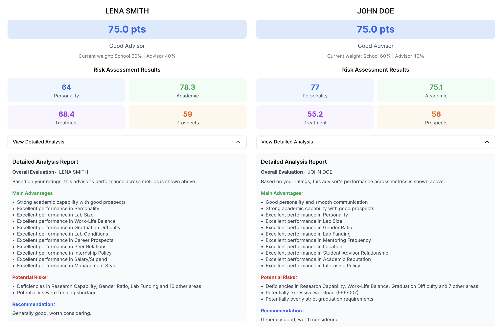

# ¿Es este asesor una trampa? Versión Calculadora
Evaluación científica de la fuerza integral del asesor, ayudándote a tomar decisiones académicas informadas.
Compara científicamente múltiples asesores para ayudarte a evitar supervisores problemáticos.

[](https://ktwu01.github.io/advisor-calculator/) [](https://github.com/ktwu01/advisor-calculator) [](https://github.com/ktwu01/advisor-calculator/fork) 

[](README.md) [](README.CN.md) [](README.es.md) [](README.fr.md) [](README.ja.md)

---



## 🎯 Características del Producto

### 🔍 Nuevo Sistema de Evaluación de 20 Dimensiones
- **Evaluación de Personalidad**: Carácter del asesor, habilidades de comunicación, estilo de gestión, relación estudiante-asesor.
- **Capacidad Académica**: Fuerza de investigación, reputación académica, perspectivas de carrera, financiación de investigación.
- **Ambiente de Trabajo**: Equilibrio vida-trabajo, condiciones del laboratorio, ubicación geográfica, tamaño del grupo de investigación.
- **Desarrollo Profesional**: Dificultad de graduación, política de prácticas, salario y beneficios, relaciones entre pares.

### 🎚️ Sistema de Ponderación Inteligente
- **Recomendación para Máster**: Universidad 60% | Asesor 40%
- **Recomendación para Doctorado**: Universidad 30% | Asesor 70%
- **Recomendación para Postdoctorado**: Universidad 20% | Asesor 80%
- **Ajuste Manual**: Soporta configuración de ponderación personalizada.
- **Consejos Inteligentes**: Explicaciones detalladas de las definiciones de ponderación.

### 📊 Informe de Análisis Inteligente
- **Visualización de Subpuntuaciones**: Puntuación de personalidad, puntuación académica, puntuación de trato, puntuación de perspectivas.
- **Identificación Precisa de Riesgos**: Identifica automáticamente todas las métricas de evaluación específicas que puntúan por debajo de 3 puntos.
- **Análisis de Ventajas Personalizado**: Destaca el rendimiento excelente (4-5 puntos).
- **Sugerencias Dirigidas**: Orientación para la toma de decisiones basada en puntos de riesgo específicos.
- **Informe Detallado Plegable**: El análisis completo se puede expandir.

### 💾 Gestión Integral de Datos
- **Funcionalidad de Importación/Exportación**: Copia de seguridad de datos en formato JSON.
- **Sistema de Apodos de Asesor**: Soporta seudónimos para la protección de la privacidad.
- **Almacenamiento Local**: Los datos son seguros y no se cargan a servidores.
- **Control de Versiones**: Los archivos de datos incluyen información de versión.

### 🎨 Excelente Experiencia de Usuario
- **Puntuación Descriptiva**: Descripciones de texto intuitivas (ej., "996/007") en lugar de números.
- **Diseño Adaptable**: Soporte perfecto para dispositivos de escritorio y móviles.
- **Cálculo en Tiempo Real**: Actualizaciones instantáneas de puntuación y sugerencias.
- **Comparación de Múltiples Asesores**: Soporta la evaluación simultánea de hasta 3 asesores.
- **Diseño de Accesibilidad**: Soporta navegación por teclado y lectores de pantalla.

## 🚀 Inicio Rápido

### Requisitos del Entorno
- Node.js 16+
- npm/yarn/pnpm/bun

### Instalación y Ejecución

```bash
# Clonar el repositorio
git clone https://github.com/ktwu01/advisor-calculator.git
cd advisor-calculator

# Instalar dependencias
npm install

# Iniciar el servidor de desarrollo
npm run dev
```

Visita [http://localhost:3000](http://localhost:3000) para ver la aplicación.

### Despliegue

```bash
# Construir para producción
npm run build

# Iniciar el servidor de producción
npm start
```

## 📋 Guía de Uso Detallada

### 1. Configuración de Información Básica
- **Apodo del Asesor**: Usa un seudónimo (ej., "Prof. X") para facilitar la identificación y gestión de datos.
- **Género del Asesor**: Influye en el cálculo del peso del estilo de gestión.
- **Rango de Edad**: Profesor Joven/Carrera Media/Senior, influye en la evaluación de la experiencia.
- **Título del Asesor**: Desde Profesor Ayudante/Asociado hasta Académico, ajusta automáticamente los pesos académicos.
- **Nivel de la Universidad**: 7 niveles desde Colegio Comunitario hasta Ivy League / Universidad de Investigación de Primer Nivel.
- **Programa de Grado**: Ajusta automáticamente la configuración de peso después de la selección.

### 2. Explicación de las 20 Métricas de Evaluación
**Dimensión de Personalidad (4 ítems)**
- Carácter del asesor, habilidades de comunicación, estilo de gestión, relación estudiante-asesor.

**Dimensión Académica (4 ítems)**
- Fuerza de investigación, reputación académica, perspectivas de carrera, financiación de investigación.

**Dimensión de Trabajo (6 ítems)**
- Equilibrio vida-trabajo, financiación del grupo de investigación, condiciones del laboratorio, ubicación geográfica, tamaño del grupo de investigación, proporción de género.

**Dimensión de Desarrollo (6 ítems)**
- Dificultad de graduación, frecuencia de tutorías, política de prácticas, salario y beneficios, costos de vida, relaciones entre pares.

### 3. Sistema de Evaluación Inteligente
- **Cálculo en Tiempo Real**: Los resultados se actualizan inmediatamente después de cada calificación.
- **Precisión Decimal**: Todas las puntuaciones se muestran con un decimal.
- **Evaluación de Nivel**: Excelente Asesor, Buen Asesor, Promedio, Algo Problemático, Grandes Señales de Alerta.

### 4. Informe de Análisis Detallado
**Información Básica**
- Puntuación total y evaluación de nivel.
- Visualización de la configuración de peso actual.

**Subpuntuaciones**
- Puntuación de personalidad, puntuación académica, puntuación de trato, puntuación de perspectivas.
- Diseño de cuadrícula 2x2, codificado por colores.

**Análisis Detallado (Plegable)**
- **Ventajas Principales**: Métricas de alta puntuación y ventajas de subcategoría.
- **Riesgos Potenciales**: Listado detallado de todas las métricas que puntúan por debajo de 3 puntos.
- **Sugerencias Personalizadas**: Orientación dirigida basada en áreas problemáticas específicas.

### 5. Gestión de Datos
- **Exportar Datos**: Guarda como un archivo JSON, incluyendo una marca de tiempo.
- **Importar Datos**: Restaura datos de evaluación anteriores.
- **Comparación de Múltiples Asesores**: Soporta la evaluación simultánea de hasta 3 asesores.

## 🛠️ Arquitectura Técnica

### Pila Tecnológica Frontend
- **Framework**: Next.js 15 + TypeScript
- **Librería de UI**: shadcn/ui (Radix UI + Tailwind CSS)
- **Iconos**: Lucide React
- **Estilo**: Tailwind CSS
- **Componentes**: Paneles plegables, tooltips, etc.

### Algoritmo Central
- **Sistema de Ponderación Inteligente**: Pesos dinámicos basados en el tipo de grado y el título del asesor.
- **Algoritmo de Identificación de Riesgos**: Detección integral de métricas de baja puntuación y generación de informes de riesgo personalizados.
- **Algoritmo de Análisis de Ventajas**: Identificación y deduplicación de ventajas multinivel.
- **Algoritmo de Generación de Sugerencias**: Sistema de sugerencias dirigido basado en problemas específicos.

### Procesamiento de Datos
- **Almacenamiento Local**: Utiliza localStorage para estadísticas de visitas.
- **Operaciones de Archivos**: Importación/exportación en formato JSON.
- **Cálculo en Tiempo Real**: Cálculo responsivo basado en el estado de React.

## 📦 Estructura del Proyecto

```
advisor-calculator/
├── README.md, README.CN.md          # Documentación del Proyecto
├── assets/                          # Activos
│   ├── Banner-advisor-calculator.png
│   └── todo.md                     # Registro de Desarrollo
├── src/
│   ├── app/
│   │   ├── page.tsx                # Componente Principal de la Aplicación
│   │   ├── layout.tsx              # Diseño de la Aplicación
│   │   └── globals.css             # Estilos Globales
│   ├── components/ui/              # Librería de Componentes de UI
│   │   ├── badge.tsx, button.tsx, card.tsx
│   │   ├── collapsible.tsx         # Componente Plegable
│   │   ├── input.tsx, label.tsx, select.tsx
│   │   ├── slider.tsx, tooltip.tsx
│   └── lib/
│       └── utils.ts                # Funciones de Utilidad
├── tailwind.config.ts              # Configuración de Tailwind
├── components.json                 # Configuración de shadcn/ui
└── deploy/                         # Configuración de Despliegue
    └── netlify.toml
```

## 🔬 Características del Algoritmo

### Identificación Precisa de Riesgos
- **Cobertura Completa**: Detecta elementos que puntúan <3 puntos en las 20 métricas de evaluación.
- **Resumen Inteligente**: Si ≤3 ítems, los lista; si >3 ítems, muestra "los 3 primeros + recuento total".
- **Advertencias Especiales**: Comprobaciones específicas para métricas críticas (ej., 996/007, dificultad de graduación).
- **Análisis por Capas**: Riesgos de métricas específicas + riesgos de subpuntuaciones.

### Sistema de Sugerencias Personalizadas
- **Rango de Puntuación Alta (≥80)**: Altamente recomendado.
- **Puntuación Media-Alta (70-79)**: Generalmente recomendado.
- **Rango de Puntuación Media (60-69)**: Se aconseja prestar especial atención a los puntos de riesgo.
- **Rango de Puntuación Baja (<60)**: Listado detallado de los principales problemas.

### Algoritmo de Ponderación Multidimensional
- **Pesos Base**: Pesos preestablecidos basados en el tipo de grado.
- **Bonificación por Título**: Académico, Catedrático Distinguido, etc., proporcionan bonificaciones de peso académico.
- **Influencia de la Universidad**: 7 niveles de prestigio universitario proporcionan bonificaciones de peso de marca.
- **Género y Edad**: Ajustes sutiles basados en la experiencia de gestión.

## 🤝 Guía de Contribución

### Flujo de Trabajo de Desarrollo
1. Haz un fork de este proyecto.
2. Crea tu rama de características (`git checkout -b feature/AmazingFeature`).
3. Confirma tus cambios (`git commit -m 'Add some AmazingFeature'`).
4. Sube a la rama (`git push origin feature/AmazingFeature`).
5. Abre una Pull Request.

### Estándares de Código
- Usa TypeScript para la verificación de tipos.
- Sigue los estándares de código ESLint + Biome.
- Los componentes usan programación funcional.
- Usa Tailwind CSS para el estilo.

### Requisitos de Prueba
- Asegúrate de que todas las funcionalidades funcionen correctamente.
- Prueba varias combinaciones de puntuación.
- Verifica las funciones de importación/exportación.
- Comprueba el diseño adaptable.

## 📄 Licencia

Este proyecto está bajo la Licencia [CC BY-NC-ND 4.0](https://creativecommons.org/licenses/by-nc-nd/4.0/).
- ✅ Permite la descarga, uso y compartición.
- ❌ Prohíbe el uso comercial.
- ❌ Prohíbe modificaciones y adaptaciones.

## ⚠️ Descargo de Responsabilidad

- **Herramienta de Referencia**: Esta herramienta es solo para referencia. Por favor, toma decisiones racionales basadas en las circunstancias reales.
- **Protección de la Privacidad**: Los datos se almacenan solo localmente y no se cargan a servidores.
- **Evaluación Subjetiva**: Los resultados de la evaluación se basan en un juicio subjetivo y no representan una precisión absoluta.
- **Responsabilidad de la Decisión**: La responsabilidad de la decisión final recae únicamente en el usuario.

## 🔗 Enlaces Relacionados

- [🌐 Demostración en Vivo](https://ktwu01.github.io/advisor-calculator/)
- [🐛 Informes de Errores](https://github.com/ktwu01/advisor-calculator/issues)
- [💡 Sugerencias de Características](https://github.com/ktwu01/advisor-calculator/discussions)
- [📖 README en Chino](README.CN.md)

## 🎉 Registro de Cambios

### v2.1.0 Última Versión
- ✅ Soporte para 5 idiomas: inglés, chino, español, francés, japonés.
- ✅ Nuevo Sistema de Evaluación de 20 Dimensiones
- ✅ Algoritmo Inteligente de Identificación de Riesgos
- ✅ Informe de Análisis Detallado Plegable
- ✅ Interfaz de Puntuación Descriptiva
- ✅ Funcionalidad Completa de Importación/Exportación
- ✅ Sistema de Comparación de Múltiples Asesores
- ✅ Configuración de Ponderación Personalizada

### Versiones Históricas
- **v2.0.0**: Se añadió el sistema de ponderación inteligente y la gestión de datos.
- **v1.5.0**: Nueva evaluación de la dimensión económica.
- **v1.0.0**: Lanzamiento del sistema de evaluación básico.

---

**Si este proyecto te es útil, ¡por favor, dale una ⭐ Estrella!**

> ¡Que cada estudiante encuentre a su asesor ideal y evite los escollos en su camino académico! 🎓
