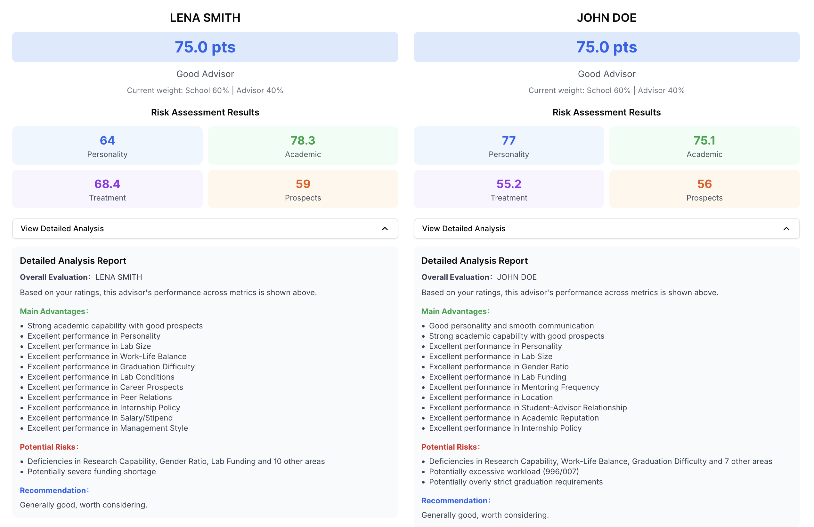

# この指導教員は落とし穴？計算ツール版
指導教員の総合的な強みを科学的に評価し、情報に基づいた学術的選択を支援します。
複数の指導教員を科学的に比較し、問題のある指導教員を避けるのに役立ちます。


[](https://advisor-calculator.onrender.com/) [](https://github.com/ktwu01/advisor-calculator) [](https://github.com/ktwu01/advisor-calculator/fork) 

[](README.md) [](README.CN.md) [](README.es.md) [](README.fr.md) [](README.ja.md)

---

Detailed-Analysis:


## 🎯 製品の特長

### 🔍 新しい20次元評価システム
- **人格評価**: 指導教員の人格、コミュニケーション能力、管理スタイル、学生と指導教員の関係。
- **学術能力**: 研究力、学術的評判、キャリア展望、研究資金。
- **労働環境**: ワークライフバランス、研究室の状況、地理的位置、研究グループの規模。
- **キャリア開発**: 卒業の難易度、インターンシップポリシー、給与と福利厚生、同僚との関係。

### 🎚️ スマートウェイトシステム
- **修士課程の推奨**: 大学 60% | 指導教員 40%
- **博士課程の推奨**: 大学 30% | 指導教員 70%
- **ポスドクの推奨**: 大学 20% | 指導教員 80%
- **手動調整**: 個別のウェイト設定をサポート。
- **スマートヒント**: ウェイト定義の詳細な説明。

### 📊 インテリジェント分析レポート
- **サブスコアの可視化**: 人格スコア、学術スコア、待遇スコア、展望スコア。
- **正確なリスク特定**: 3点未満のすべての特定の評価指標を自動的に特定します。
- **パーソナライズされた利点分析**: 優れたパフォーマンス (4-5点) を強調します。
- **ターゲットを絞った提案**: 特定のリスクポイントに基づいた意思決定ガイダンス。
- **折りたたみ可能な詳細レポート**: 完全な分析を展開できます。

### 💾 包括的なデータ管理
- **インポート/エクスポート機能**: JSON形式のデータバックアップ。
- **指導教員ニックネームシステム**: プライバシー保護のための仮名をサポート。
- **ローカルストレージ**: データは安全で、サーバーにアップロードされません。
- **バージョン管理**: データファイルにはバージョン情報が含まれます。

### 🎨 優れたユーザーエクスペリエンス
- **記述的なスコアリング**: 数字の代わりに直感的なテキスト記述 (例: 「996/007」)。
- **レスポンシブデザイン**: デスクトップおよびモバイルデバイスを完全にサポート。
- **リアルタイム計算**: スコアと提案の即時更新。
- **複数指導教員比較**: 最大3人の指導教員の同時評価をサポート。
- **アクセシビリティデザイン**: キーボードナビゲーションとスクリーンリーダーをサポート。

## 🚀 クイックスタート

### 環境要件
- Node.js 16+
- npm/yarn/pnpm/bun

### インストールと実行

```bash
# リポジトリをクローン
git clone https://github.com/ktwu01/advisor-calculator.git
cd advisor-calculator

# 依存関係をインストール
npm install

# 開発サーバーを起動
npm run dev
```

[http://localhost:3000](http://localhost:3000) にアクセスしてアプリケーションを表示します。

### デプロイ

```bash
# プロダクション用にビルド
npm run build

# プロダクションサーバーを起動
npm start
```

## 📋 詳細な使用ガイド

### 1. 基本情報の設定
- **指導教員ニックネーム**: データ管理と識別のために仮名 (例: 「X教授」) を使用します。
- **指導教員性別**: 管理スタイルのウェイト計算に影響します。
- **年齢層**: 若手/中堅/ベテラン教員、経験評価に影響します。
- **指導教員称号**: 助教/准教授からアカデミー会員まで、学術的なウェイトを自動的に調整します。
- **学校レベル**: コミュニティカレッジからアイビーリーグ/トップティア研究大学までの7つのレベル。
- **学位プログラム**: 選択後、ウェイト設定を自動的に調整します。

### 2. 20の評価指標の説明
**人格の側面 (4項目)**
- 指導教員の人格、コミュニケーション能力、管理スタイル、学生と指導教員の関係。

**学術の側面 (4項目)**
- 研究力、学術的評判、キャリア展望、研究資金。

**仕事の側面 (6項目)**
- ワークライフバランス、研究グループの資金、研究室の状況、地理的位置、研究グループの規模、性別比率。

**開発の側面 (6項目)**
- 卒業の難易度、指導の頻度、インターンシップポリシー、給与と福利厚生、生活費、同僚との関係。

### 3. インテリジェント評価システム
- **リアルタイム計算**: 各評価後すぐに結果が更新されます。
- **小数点以下の精度**: すべてのスコアは小数点以下1桁で表示されます。
- **レベル評価**: 優秀な指導教員、良い指導教員、平均、やや問題あり、重大な危険信号。

### 4. 詳細な分析レポート
**基本情報**
- 合計スコアとレベル評価。
- 現在のウェイト設定の表示。

**サブスコア**
- 人格スコア、学術スコア、待遇スコア、展望スコア。
- 2x2グリッドレイアウト、色分け。

**詳細分析 (折りたたみ可能)**
- **主な利点**: 高得点の指標とサブカテゴリの利点。
- **潜在的なリスク**: 3点未満のすべての指標の詳細なリスト。
- **パーソナライズされた提案**: 特定の問題領域に基づいたターゲットを絞ったガイダンス。

### 5. データ管理
- **データのエクスポート**: タイムスタンプを含むJSONファイルとして保存されます。
- **データのインポート**: 以前の評価データを復元します。
- **複数指導教員比較**: 最大3人の指導教員の同時評価をサポートします。

## 🛠️ 技術アーキテクチャ

### フロントエンド技術スタック
- **フレームワーク**: Next.js 15 + TypeScript
- **UIライブラリ**: shadcn/ui (Radix UI + Tailwind CSS)
- **アイコン**: Lucide React
- **スタイル**: Tailwind CSS
- **コンポーネント**: 折りたたみ可能なパネル、ツールチップなど。

### コアアルゴリズム
- **スマートウェイトシステム**: 学位の種類と指導教員の称号に基づいた動的なウェイト。
- **リスク特定アルゴリズム**: 低スコアの指標の包括的な検出とパーソナライズされたリスクレポートの生成。
- **利点分析アルゴリズム**: 多段階の利点特定と重複排除。
- **提案生成アルゴリズム**: 特定の問題に基づいたターゲットを絞った提案システム。

### データ処理
- **ローカルストレージ**: 訪問統計にlocalStorageを使用します。
- **ファイル操作**: JSON形式のインポート/エクスポート。
- **リアルタイム計算**: Reactの状態に基づいた応答性の高い計算。

## 📦 プロジェクト構造

```
advisor-calculator/
├── README.md, README.CN.md          # プロジェクトドキュメント
├── assets/                          # アセット
│   ├── Banner-advisor-calculator.png
│   └── todo.md                     # 開発ログ
├── src/
│   ├── app/
│   │   ├── page.tsx                # メインアプリケーションコンポーネント
│   │   ├── layout.tsx              # アプリケーションレイアウト
│   │   └── globals.css             # グローバルスタイル
│   ├── components/ui/              # UIコンポーネントライブラリ
│   │   ├── badge.tsx, button.tsx, card.tsx
│   │   ├── collapsible.tsx         # 折りたたみ可能コンポーネント
│   │   ├── input.tsx, label.tsx, select.tsx
│   │   ├── slider.tsx, tooltip.tsx
│   └── lib/
│       └── utils.ts                # ユーティリティ関数
├── tailwind.config.ts              # Tailwind設定
├── components.json                 # shadcn/ui設定
└── deploy/                         # デプロイ設定
    └── netlify.toml
```

## 🔬 アルゴリズムの特長

### 正確なリスク特定
- **包括的なカバレッジ**: 20の評価指標すべてで3点未満の項目を検出します。
- **インテリジェントな要約**: 3項目以下の場合はリスト表示、3項目を超える場合は「最初の3項目 + 合計数」を表示します。
- **特別な警告**: 重要な指標 (例: 996/007、卒業の難易度) の特定のチェック。
- **階層化された分析**: 特定の指標のリスク + サブスコアのリスク。

### パーソナライズされた提案システム
- **高スコア範囲 (≥80)**: 強く推奨。
- **中高スコア (70-79)**: 一般的に推奨。
- **中スコア範囲 (60-69)**: リスクポイントに特に注意を払うことを推奨。
- **低スコア範囲 (<60)**: 主要な問題の詳細なリスト。

### 多次元ウェイトアルゴリズム
- **基本ウェイト**: 学位の種類に基づいた事前設定されたウェイト。
- **称号ボーナス**: アカデミー会員、長江学者などの称号は学術的なウェイトボーナスを提供します。
- **学校の影響**: 7段階の学校の評判はブランドのウェイトボーナスを提供します。
- **性別と年齢**: 管理経験に基づいた微妙な調整。

## 🤝 貢献ガイド

### 開発ワークフロー
1. このプロジェクトをフォークします。
2. 機能ブランチを作成します (`git checkout -b feature/AmazingFeature`)。
3. 変更をコミットします (`git commit -m 'Add some AmazingFeature'`)。
4. ブランチにプッシュします (`git push origin feature/AmazingFeature`)。
5. プルリクエストを開きます。

### コード標準
- 型チェックにはTypeScriptを使用します。
- ESLint + Biomeのコード標準に従います。
- コンポーネントは関数型プログラミングを使用します。
- スタイルにはTailwind CSSを使用します。

### テスト要件
- すべての機能が正しく動作することを確認します。
- さまざまなスコアリングの組み合わせをテストします。
- インポート/エクスポート機能を検証します。
- レスポンシブレイアウトを確認します。

## 📄 ライセンス

このプロジェクトは [CC BY-NC-ND 4.0](https://creativecommons.org/licenses/by-nc-nd/4.0/) ライセンスの下でライセンスされています。
- ✅ ダウンロード、使用、共有が可能です。
- ❌ 商業目的での使用は禁止されています。
- ❌ 変更および翻案は禁止されています。

## ⚠️ 免責事項

- **参考ツール**: このツールは参考用です。実際の状況に基づいて合理的な選択をしてください。
- **プライバシー保護**: データはローカルにのみ保存され、サーバーにはアップロードされません。
- **主観的評価**: 評価結果は個人の主観的な判断に基づいており、絶対的な正確性を保証するものではありません。
- **意思決定の責任**: 最終的な選択の責任はユーザー自身にあります。

## 🔗 関連リンク

- [🌐 ライブデモ](https://ktwu01.github.io/advisor-calculator/)
- [🐛 バグレポート](https://github.com/ktwu01/advisor-calculator/issues)
- [💡 機能の提案](https://github.com/ktwu01/advisor-calculator/discussions)
- [📖 中国語版README](README.CN.md)

## 🎉 更新履歴

### v2.1.0 最新バージョン
- ✅ 英語、中国語、スペイン語、フランス語、日本語の5言語対応
- ✅ 新しい20次元評価システム
- ✅ スマートリスク特定アルゴリズム
- ✅ 折りたたみ可能な詳細分析レポート
- ✅ 記述的なスコアリングインターフェース
- ✅ 完全なインポート/エクスポート機能
- ✅ 複数指導教員比較システム
- ✅ パーソナライズされたウェイト設定

### 過去のバージョン
- **v2.0.0**: スマートウェイトシステムとデータ管理を追加。
- **v1.5.0**: 経済的側面の新しい評価を追加。
- **v1.0.0**: 基本評価システムをリリース。

---

**このプロジェクトが役に立った場合は、⭐ スターをお願いします！**

> すべての学生が理想の指導教員を見つけ、学術の道での落とし穴を避けられますように！🎓
